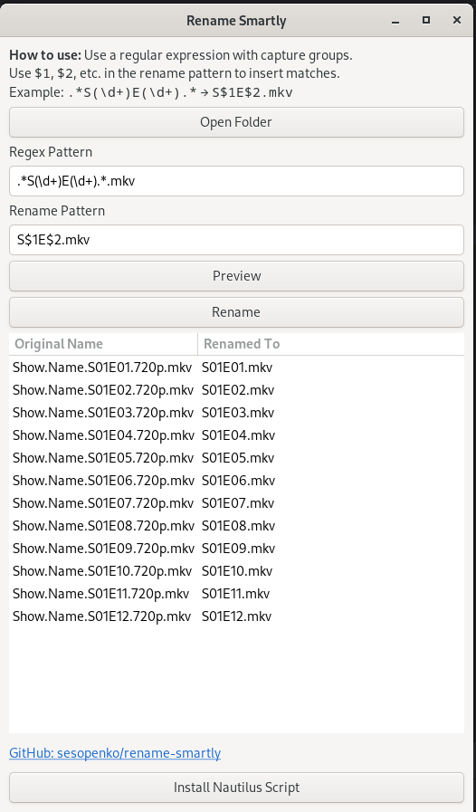

# Rename Smartly

**Rename Smartly** is a simple, fast, and user-friendly desktop app for batch-renaming files in a folder using regular
expressions and replacement patterns.

It provides a graphical interface that shows a live preview of how your files will be renamed. Ideal for renaming TV
shows, logs, images, or any structured filenames.


---

## Requirements

* Debian based linux (deb tested on Debian 12 amd64)
* Python 3.11 or later

---

## ✨ How It Works

1. **Select a folder** using the "Open Folder" button.
2. **Enter a regular expression (regex)** in the pattern input field.
3. **Define a rename pattern** using `$1`, `$2`, etc., to represent capture groups from the regex.
4. Click **Preview** to see what the files will be renamed to.
5. Click **Rename** to apply the changes.

### 🧪 Example

#### Regex:

```
.*S(\d+)E(\d+).*.mkv
```

#### Rename Pattern:

```
S$1E$2.mkv
```

#### Input File:

```
Show.Name.S02E05.720p.mkv
```

#### Result:

```
S02E05.mkv
```

> Files that do **not match** the regex will be listed, but left unchanged (shown with an empty "Renamed To" column).

---

### Nautilus Integration

When installed via the deb pressing the "Install Nautilus Script" button will add a script to
`~/.local/share/nautilus/scripts/Rename\ Smartly`. This enables a Scripts -> Rename Smartly context menu when
right-clicking folders in Nautilus.

## Installation

1. Download deb from [Releases](https://github.com/sesopenko/rename-smartly/releases)
2. `sudo dpkg -i rename-smartly_<version>_all.deb` ie: `sudo dpkg -i rename_smartly_1.1_all.deb`

---

## 🛠️ Dev Dependencies

Developed on **Debian 12**. To build or run from source:

```bash
sudo apt update
sudo apt install -y \
  python3 python3-pip \
  python3-gi gir1.2-gtk-3.0 \
  libglib2.0-dev libgirepository1.0-dev \
  build-essential fakeroot dh-make devscripts
```

---

## 🚀 Runtime Dependencies (for end users)

To run the app on **Debian 12**, make sure the following are installed:

```bash
sudo apt install -y python3 python3-gi gir1.2-gtk-3.0
```

These packages provide the GTK bindings needed for the graphical interface.

---

## 📄 License

This project is licensed under the [GNU General Public License v3.0](LICENSE.txt).

---

## ©️ Copyright

© Sean Esopenko 2025

